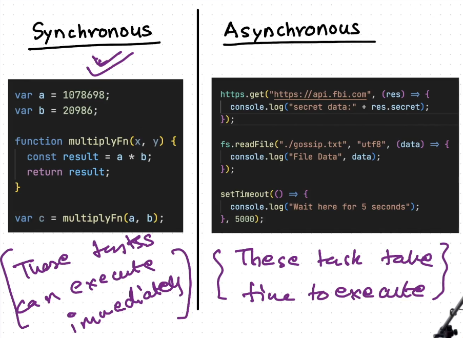
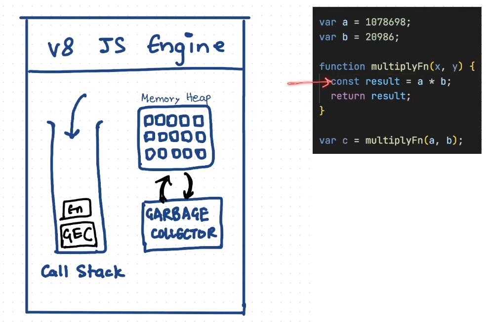
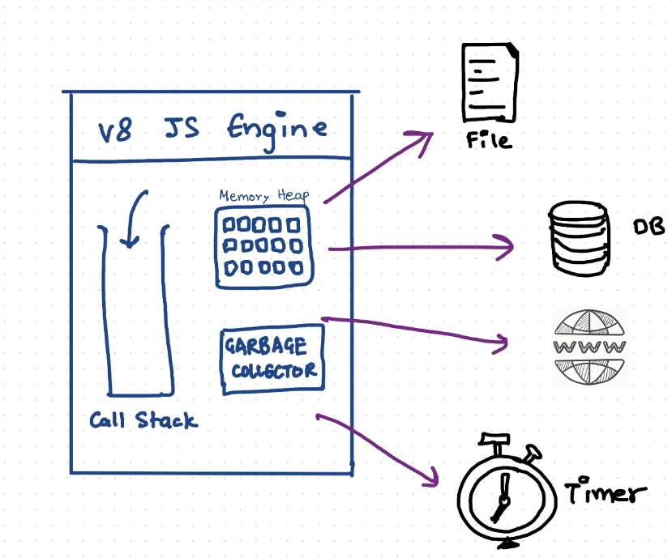
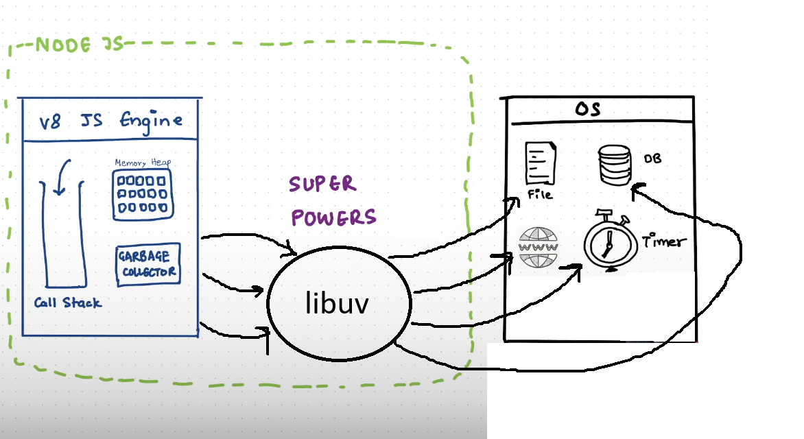
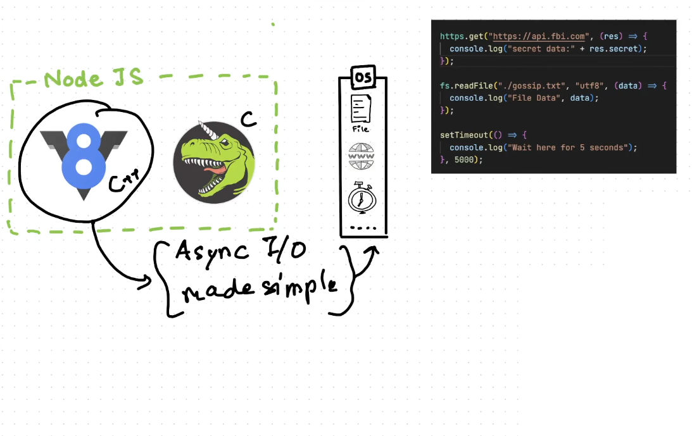
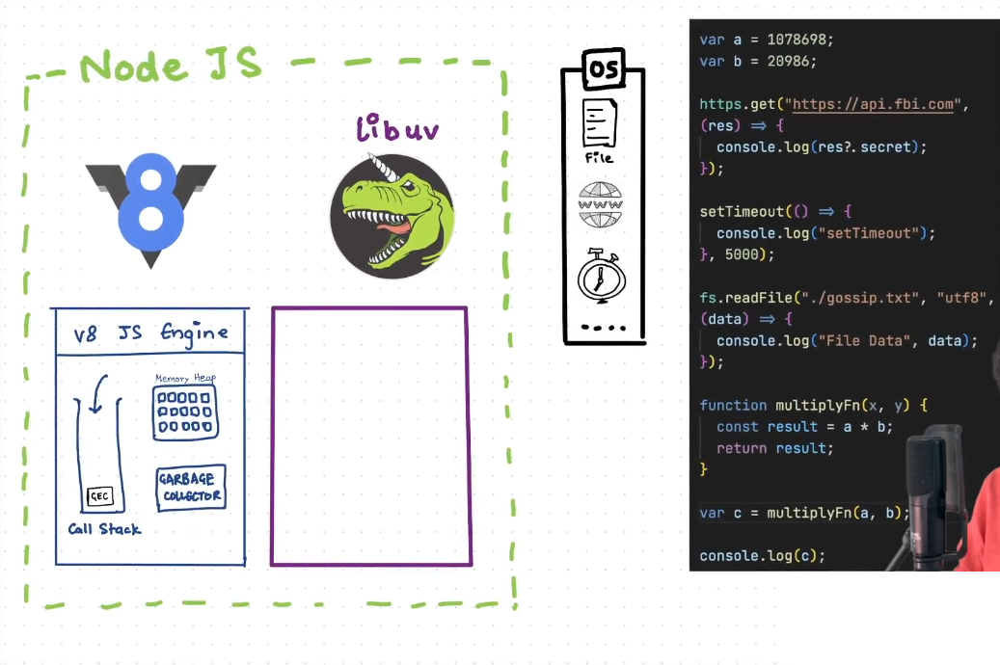
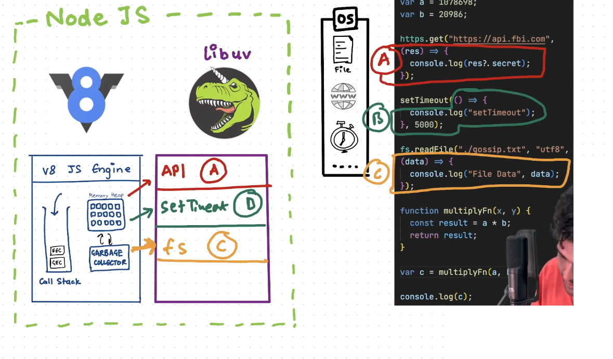

# Node.js
## NodeJS wikipedia
- NodeJs has an **event driven architecture** capable of asynchronous I/O.

## Javascript
- It is a synchronous single threaded language.
- Synchronous -> The code runs line by line, next line can be executed after previous line.
- Single Threaded -> Using a single thread using a single memory.
- It is run on the v8 engine, it runs very fast.

## Restaurant Example
- Counter having a queue.
  - Noodles -> 5 minutes
  - Pizza -> 10 minutes
  - Coke -> 0 minutes

### 1. Synchronous Example
- In the queue [Counter] <- A(Coke) <- B(Noodles) <- C(Pizza) <- D(Coke) <- E(Noodles)
- If it works in a synchronous manner.
- A <- Waiting for 0 minutes (0)
- B <- Waiting for 5 minutes (0 + 5)
- C <- Waiting for 15 minutes (0 + 5 + 10)
- D <- Waiting for 15 minutes (0 + 5 + 10 + 0)
- E <- Waiting for 20 minutes (0 + 5 + 10 + 0 + 5)

### 2. Asynchronous Example
- In the queue [Counter] <- A(Coke) <- B(Noodles) <- C(Pizza) <- D(Coke) <- E(Noodles)

- The person can order and can wait in the waiting area, if it works in an asynchronous manner.
- A <- Waiting for 0 minutes (0 minutes)
- B <- Places the order and goes to waiting area for 5 minutes (5 minutes as it will get after 5 minutes)
- C <- Places the order and goes to waiting area for 10 minutes (10 minutes as it will get after 10 minutes)
- D <- Waiting for 0 minutes (0 minutes)
- E <- Places the order and goes to waiting area for 10 minutes (10 minutes as it will get after 10 minutes)

- In this all the persons are placing the order and going to the waiting area.

## Conclusion :-
### Javascript is synchronous but the NodeJS can execute in the asynchronous manner.

- Javascript code does not like the Asynchronous code.
- Javascript code which is synchronous can execute very quickly.
- Asynchronous task takes time to execute.

### Javascript synchronous code execution :- 
- Javascript has a v8 engine which has :-
  1. Call Stack
  2. Memory Heap
  3. Garbage Collector

#### Code
- Whole code is running on the single thread (Call Stack)
- Whenever the above is executed a Global Execution Context(GEC) is created.
- The variables are stored inside the MEMORY HEAP i.e. [a and b] are stored in the memory.
- The function execution context(FEC) is put to the CALL STACK after the GEC.
- Now c will be allocated memory in the MEMORY HEAP.
- Garbage collector interacts with the Memory Heap and deletes the memory which is not required after the execution of the program.

### NOTE:-
- Time, Tide and Javascript waits for None.

- Javascript engine does not wait for the some seconds etc.
- NodeJS gives the capability to the Javascript code to execute after some time.

- Javascript engine with the help of the **libuv** connect with the Operating System.

## libuv
- libuv is a multi-platform C library that provides support for asynchronous I/O based on event loops.
- It is a c code, which makes the asynchronous IO simpler.
- Timer, threadpool and eventloop is present in the libuv.
- NodeJS -> libuv repository -> https://github.com/nodejs/node/tree/main/deps/uv

- All the asynchronous tasks such as the api calls, timer tasks, and the file operations are done by the libuv for the Javascript v8 Engine.

- Synchronous code is handled by the JavaScript engine and the Asynchronous code is handled by the libuv.

- NodeJS is asynchronous but v8 engine is synchronous which is because of the libuv.
- This is why we say that NodeJS can do asynchronous IO.
- Non-Blocking IO using v8 engine -> It is not blocking the main thread.
- With a single thread we can do all the operations in the NodeJS setup.

