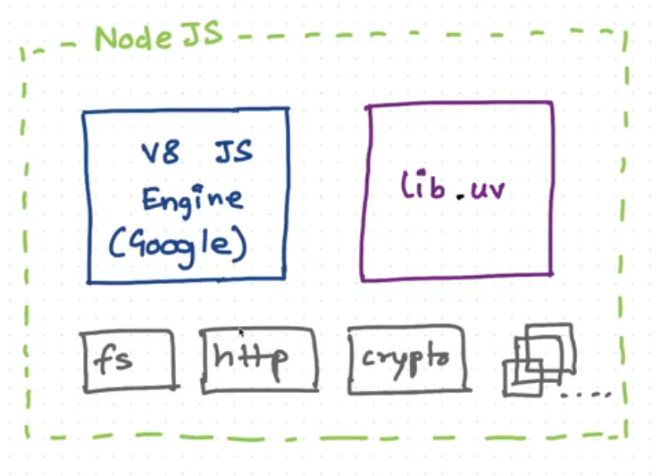
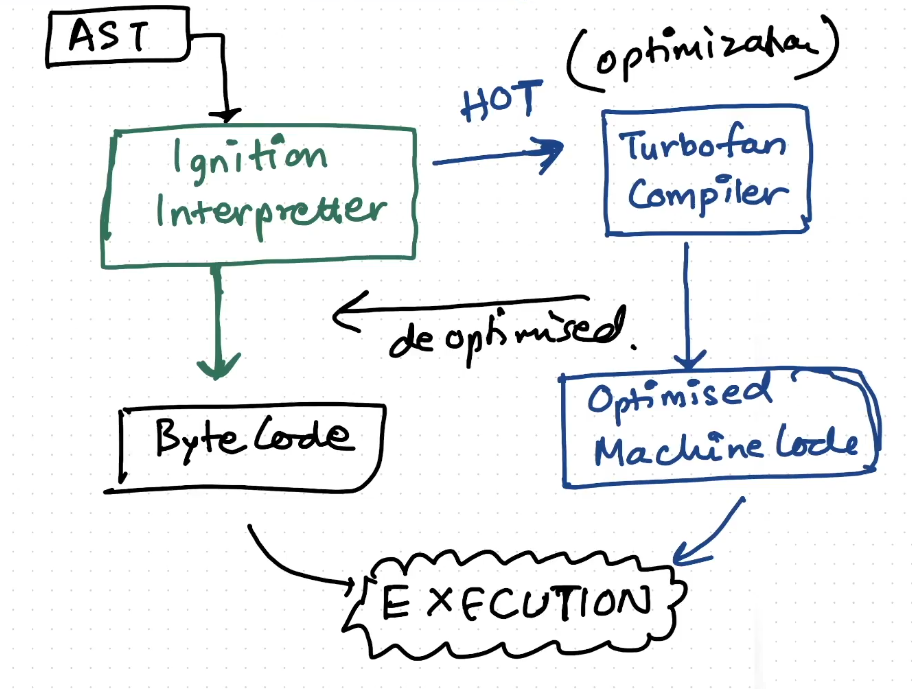
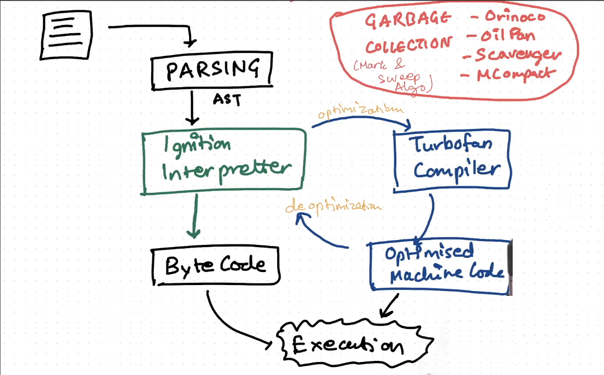

# Deep dive into v8 JS Engine


- There are two main components of the NodeJS runtime environment:
  - v8 JS Engine (Google)
  - libuv
- These two components are responsible to execute the JS code.

## v8 JS Engine (Google)
- Code is given to the v8 engine which gives it to the following stages
  - `Parsing or Lexical Analysis` is done which involves the conversion of the code into the tokens, which helps in reading the code(Tokenization).

  - `Syntax Analysis` is done, in which the tokens are converted to the AST (Abstract Systax Tree). We can convert the code to the AST using the website -> AST Explorer. Variables are the identifiers, strings are the literals etc. Abstract Sytax Tree generation failure results in the Syntax Error.

  - `Ignition Interpreter` - AST is given to the Ignition Interpretter. Google's Interpretor is called the Ignition Interpretter. It converts the code to the (Byte Code). Then the execution of the code happens.

  - `Turbofan Compiler` - It is a compiler which gets the repeatable code(hot code) from the ignition interpretter. It works behind the scene to do these tasks to get the Optimised Machine Code and then it gets executed.

## Types of Languages:
1. `Interpretted Language`
   - Code executes line by line.
   - Fast Initial Execution.
   - Interprettor is there.

2. `Compiled Language`
   - The whole code is compiled.
   - The code is converted to machine code.
   - Initially processing is heavy but executed very fast.
   - Compilers are used.

3. `Javascript`
   - It uses the interprettor as well as a compiler.
   - JIT(Just In Time) Compilation is used.

- The code which is faster to execute is executed by the `Ignition Interpretter` and the code which needs optimization is given to the `Turbofan Compiler` before the execution.

- Deoptimization is required because the Compiler makes assumptions regarding the code which is executed, so to avoid the failure in execution of the code properly the code is deoptimized and is executed by the Ignition Interpretter.



- The above diagram represents the Just In Time Compilation.

## Inline Caching
Inline caching (IC) is an important optimization technique used by V8 to speed up property access operations in JavaScript. Here's how it works:

1. `Basic Concept`:
   - When JavaScript code accesses an object's property repeatedly, V8 caches the location of the property in memory.

   - Instead of looking up the property each time, it can directly jump to the cached location.

   - This significantly improves performance for repeated property access.

2. `Types of Inline Caching`:
   - `Monomorphic`: When an operation always handles the same type/shape of object (fastest)
   - `Polymorphic`: When it handles a few (usually up to 4) different types.
   - `Megamorphic`: When it handles many different types (slowest)

Example:
```js
function getName(user) {
    return user.name;  // V8 will inline cache the offset of 'name' property
}

// Monomorphic - all objects have same shape
const user1 = { name: 'John' };
const user2 = { name: 'Jane' };
getName(user1);
getName(user2);  // Uses cached location

// Polymorphic - different shapes
const user3 = { name: 'Bob', age: 30 };  // Different shape
getName(user3);  // New cache entry created
```

3. Benefits:
   - Reduces property lookup time
   - Improves execution speed significantly
   - Most effective when code is predictable (same types used repeatedly)

4. Hidden Classes:
   - V8 creates hidden classes to track object shapes
   - Objects with same properties in same order share hidden classes
   - Inline caching uses these hidden classes to optimize property access

To maintain good inline caching:
- Always initialize objects with same properties in same order
- Avoid adding properties after creation
- Try to keep object shapes consistent throughout your code

This optimization is one of the key reasons why V8 can execute JavaScript code so efficiently.


## Copy Elision
In JavaScript, there isn't a direct equivalent to copy elision as found in C++, because JavaScript handles objects and memory management differently. However, I'll explain how JavaScript manages similar scenarios:

1. `Object References`:
   - JavaScript objects are passed by reference, not by value
   - There's no actual copying of objects in memory when assigning them
```js
const obj1 = { name: 'John' };
const obj2 = obj1; // No copy is made, both variables reference the same object
```

2. `V8 Engine Optimizations`:
- V8 uses various optimization techniques like:
  - Hidden classes
  - Inline caching
  - Object property access optimization But these are different from copy elision

3. `Object Spread Operation`:
```js
const original = { 
   a: 1, 
   b: 2
};
const copy = { ...original }; // Creates a shallow copy
```

While this looks like it's copying, V8 optimizes this operation internally for better performance.

4. `Array Operations`:
```js
// V8 optimizes these operations internally
const arr1 = [1, 2, 3];
const arr2 = arr1.slice(); //Creates a new array
const arr3 = [...arr1];    // Spread operator
```
5. `Memory Management`:
   - JavaScript uses garbage collection
   - Memory allocation and deallocation is handled automatically
   - No explicit memory management like in C++
The concept of copy elision isn't relevant in JavaScript because:

- Objects are always references
- Memory management is automatic
- The language doesn't have explicit copy constructors
- Object copying, when needed, is handled by specific methods or operators

Instead of worrying about copy elision, in JavaScript you should focus on:
- Understanding reference vs value behavior
- Using appropriate methods for object copying when needed
- Leveraging V8's built-in optimizations through consistent coding patterns

- Garbage Collection is also happening along with the Code Execution.
- The garbage collector are named Orinoco, Oil Pan, Scavenger, MCompact.



- [Link to the turbofan compiler](https://github.com/v8/v8/tree/main/src/compiler).

- Gramshaft was the earlier compiler which was used before turbofan.
