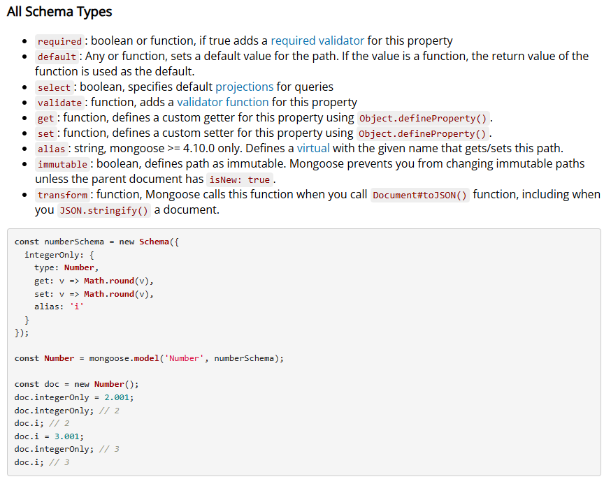

# Data Sanitization & Schema Validation
- Till now we have not put any checks to push only the correct data in our database.

## Mandatory Feilds :
- Some of the fields will be required always in the database.
- These fields can be id, password, email, firstname and lastname.
- These are required to signup a user.

## Schema Level Validations:-
- https://mongoosejs.com/docs/schematypes.html

```js
const mongoose = require("mongoose");

const userSchema = new mongoose.Schema({
    firstName: {
        type: String,
        required: true,
        minLength: 4,
        maxLength: 50,
    },
    lastName: {
        type: String,
    },
    emailId: {
        type: String,
        required: true,
        unique: true,
        lowercase: true,
        trim: true,
    },
    password: {
        type: String,
        required: true,
    },
    age: {
        type: Number,
        min: 18,

    },
    gender: {
        type: String,
        validate(value){
            if(!["male", "female", "Others"].includes(value)){
                throw new Error("Gender data is not Valid");
            }
        }
    },
    photoUrl : {
        type: String,
        default : "https://static.vecteezy.com/system/resources/previews/045/944/199/non_2x/male-default-placeholder-avatar-profile-gray-picture-isolated-on-background-man-silhouette-picture-for-user-profile-in-social-media-forum-chat-greyscale-illustration-vector.jpg"
    },
    about : {
        type : String,
        default : "This is a default about for the User"
    },
    skills : {
        type : [String],
    }
});

const UserModel = mongoose.model("User", userSchema);
module.exports = UserModel;
```

## NOTE:
- The validator function will not run by default on the update API.
- The option for the validation should be enabled in the findByIdAndUpdate().
- We can give the timestamp in the Model definition
- Now our Database will not be polluted.
- We have improved the database schema.
- We have put all the appropriate validations on each feild in the Schema.
- Add the timestamp in the schema.

## API Level Validations:
```js
app.patch("/user/:userId",
    async (req, res) => {
        const userId = req.params?.userId;
        const data = req.body;

        /* API Level Validation */
        const ALLOWED_UPDATES = ["photoUrl", "about", "gender", "age", "skills"];

        /* Loop the data through the keys in the ALLOWED_UPDATES */
        /* isAllowedUpdates is false if any of the key is not present in this */
        const isAllowedUpdates = Object.keys(data).every((k) =>
            ALLOWED_UPDATES.includes(k)
        );

        /* We will return of the isAllowedUpdates is false */
        if(!isAllowedUpdates){
            throw new Error("Update not allowed");
        }

        try {
            const user = await User.findByIdAndUpdate({ _id: userId }, data, {
                returnDocument: "after",
                runValidators: true,
            });
            res.send("User Updated Successfully");
        }
        catch (err) {
            res.status(400).send("User Updated Failed" + err.message);
        }
    }
);
```

- The userId should also not be allowed to update.

## API Level Validation for the limited number of the skills:

## API Level Validation for patch for /user and /signup:

## Library for Validation
- validator.js library can be used to validate the email and other things in our project.
- https://www.npmjs.com/package/validator
- npm i validator

### 1. Email Validation
```js
    emailId: {
        type: String,
        required: true,
        unique: true,
        lowercase: true,
        trim: true,
        validate(value){
            if(!validator.isEmail(value)){
                throw new Error("Invalid email address" + value);
            }
        }
    },
```

### 2. Photo URL Validation
```js
    photoUrl : {
        type: String,
        default : "https://static.vecteezy.com/system/resources/previews/045/944/199/non_2x/male-default-placeholder-avatar-profile-gray-picture-isolated-on-background-man-silhouette-picture-for-user-profile-in-social-media-forum-chat-greyscale-illustration-vector.jpg",
        validate(value){
            if(!validator.isURL(value)){
                throw new Error("The photo URL is not valid");
            }
        }
    },
```

## NOTE:
- DO NOT TRUST THE req.body() always do the validation.


