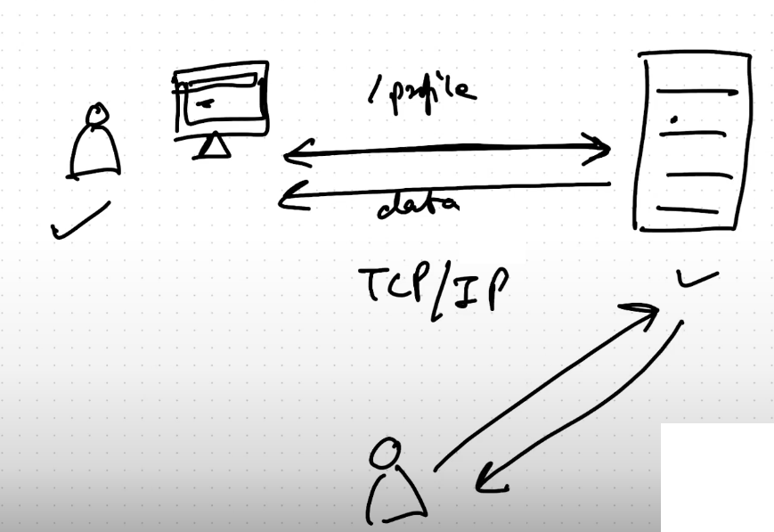
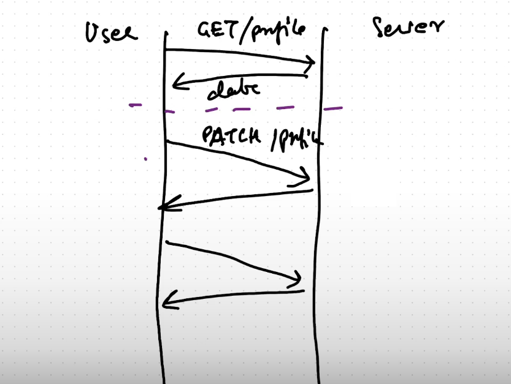
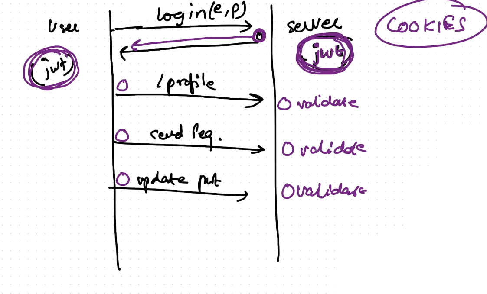
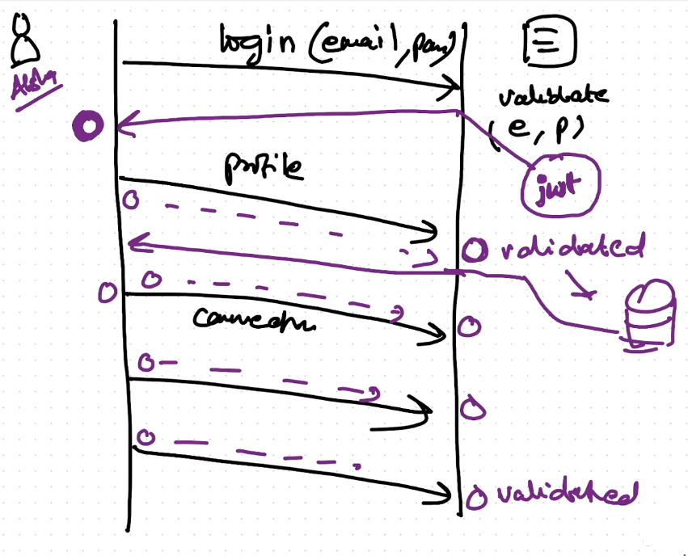
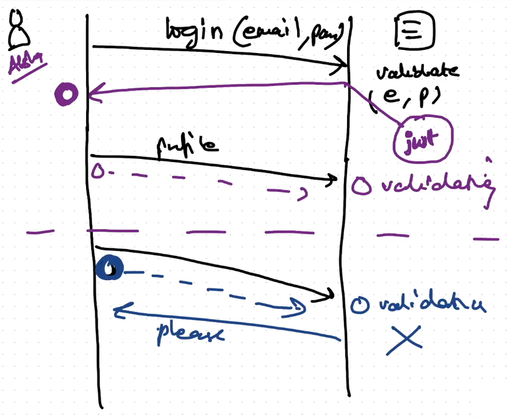
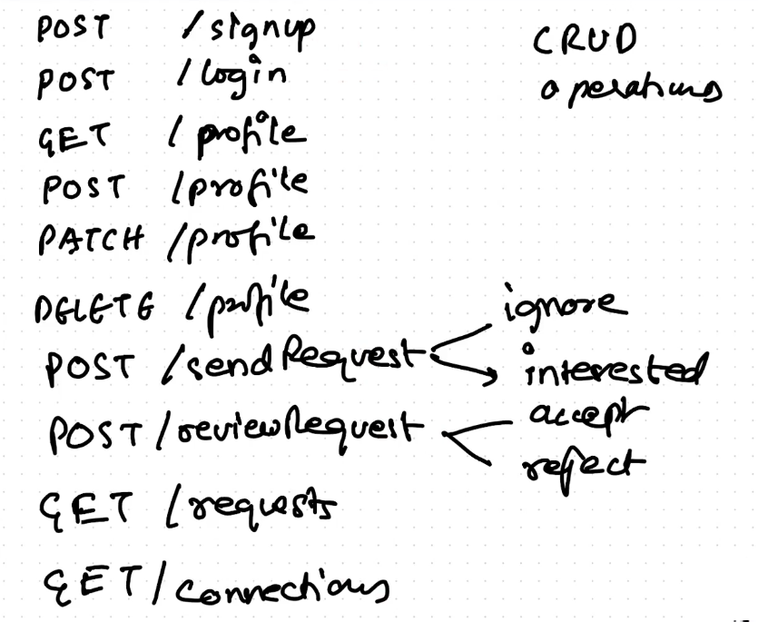

# Authentication JWT Cookies
- The User should not be able to do anything if it is not Logged IN.
- After the authentication is successful, then only the user should be able to access the Profile APIs.
- Many users are trying to update the profile or make changes in the profile on the server, using the API calls.


- User makes a GET request, the server sends the data back, and then the connection is closed.
- User makes a patch request or POST request then the server updates the data using the API call.


## What happens when we log in?
- When a User Login using the (emailId, password) the server returns a JWT token to the client.
- Then when the further requests are made from the client the JWT token is sent along with the request to the server.
- The User stores the JWT Token when the server returns it, in the cookie.
- The response which the server sends back to the client is sent with the cookie which contains the JWT Token.





## When will the Cookie stop working?
- We can send the expiry of the JWT Token, so the cookie can expire in 10seconds, 1 hour or 1 day.
- If the session is expired the validation with the old cookie will fail, when the API request is made to the server.



## Adding the JWT Token and the Cookie in the /login API
- This is the link for the reference to add the cookies.
- https://expressjs.com/en/5x/api.html#res.cookie 
```js
res.cookie("token", "dbhuadkfbndfjksdbnfkbsdhfbsffsbdkjfnsdkfnbsdjkn")
```

## Reading cookie from the APIs:
- We can read the cookies from the following API:
```js
app.get("/profile",
    async (req, res) => {
        const cook = req.cookies;
        console.log(cook);
        res.send("Reading the Cookie");
    }
);
```

- We will require a middleware to read the cookies or a parser to read the cookies.
- https://expressjs.com/en/resources/middleware/cookie-parser.html
- The cookie parser is also developed by the expressJS package.
- npm install cookie-parser
```js
const cookieParser = require("cookie-parser")
app.use(cookieParser());
```

- Now we will extract the cookies in the /profile API and validate the token.

## JWT Token 
- JSON Web Token.
- It contains some secret information in it.

- There are 3 things in the JWT Token.
  - Header
  - Payload or Secret Data
  - Signature to check the token is valid or not.

- json web token is used to create a jwt token, sign the token and verify the token.
- https://www.npmjs.com/package/jsonwebtoken
- To install the JWT token
  - npm install jsonwebtoken

```js
app.post("/login",
    async (req, res) => {
        try {
            const { emailId, password } = req.body;

            /* 1. Check the email Id is valid or not? */
            const user = await User.findOne({ emailId: emailId });
            if (!user) {
                throw new Error("User with the Email id is not present in the Database");
            }

            /* 2. Check that the password is valid or not  */
            const isValidPassword = await bcrypt.compare(password, user.password);
            if (!isValidPassword) {
                throw new Error("Password is not valid");
            }
            else {

                /* Password is valid */
                /* 1. Create a JWT Token */
                const token = await jwt.sign({_id: user._id}, "Dev@Tinder$790");
                console.log(token);

                /* 2. Add the token to cookie and send it back to the client */
                res.cookie("token", token)
                res.send("User Login Successfully");
            }

        } catch (err) {
            res.status(400).send("ERROR: " + err.message);
        }
    }
);
```
## Cookie Hijacking or Cookie Stealing
- It is a famous attack in which the Hacker steals the cookie and gets the jwt token from the user.
- In the above API for /login we have successfully send the cookie with the JWT token to the client.

## Validation of the cookie in the /profile API
```js
app.get("/profile",
    async (req, res) => {
        try {
            /* Get the Cookie inserted in the Server by the /login API */
            const cookies = req.cookies;
            const { token } = cookies;
            if(!token){
                throw new Error("The token is not valid");
            }

            /* Validate the Token */
            const decodedMessage = await jwt.verify(token, "Dev@Tinder$790");

            /* Get the id of the user from the decoded message */
            const { _id } = decodedMessage;

            /* Find the user by the _id */
            const user = await User.findById({ _id: _id });
            if(!user){
                throw new Error("No such user Exists");
            }

            res.send(user);
        } catch (err) {
            res.status(400).send("ERROR: "+err.message);
        }
    }
);
```


- The API's /signup and the /login API's are the only one which are not secure.
- Rest all the API's will be secure and can only be called after the /login is done.

## Creating the Authentication Middleware:-
```js
const jwt = require("jsonwebtoken");
const User = require("../models/User");

const userAuth = async (req, res, next) => {
    try {
        /* Read the token from the request */
        const cookies = req.cookies;

        /* Get the token from the cookies */
        const { token } = cookies;
        if (!token) {
            throw new Error("Token is not Valid!!!!!");
        }

        /* Verify the Token */
        const { decodedMessage } = await jwt.verify(token, "Dev@Tinder$790");

        /* Get the _id of the User from the Decoded Message */
        const { _id } = decodedMessage;

        /* Get the User with the id */
        const user = await User.findById({ _id: _id });
        if (!user) {
            throw new Error("User Not Found");
        }

        req.user = user;
        
        /* To move to the request handler */
        next();
    } catch (err) {
        res.status(400).send("ERROR: " + err.message);
    }
}

module.exports = {
    userAuth
}
```

- Now we only have to add the userAuth middleware in the /profile API, and the /profile API will only return the user object.
```js
app.get("/profile", userAuth, 
    async (req, res) => {
        try {
            /* Get the user object from the userAuth middleware */
            const user = req.user;

            /* Send back the user object as response */
            res.send(user);
            
        } catch (err) {
            res.status(400).send("ERROR: "+err.message);
        }
    }
);
```

## Note:
- We do not have to destructure the decodedMessage, it can be { decodedMessage }.

## How to expire the JSON Web Token?
```js
const token = await jwt.sign({ _id: user._id }, "Dev@Tinder$790",{
                    expiresIn: "1d"
                });
```
- Some of the websites never expires the JWT Token like gmail, netflix etc.

## How to expire the Cookies?
- We can set the httpOnly, expires argument in the res.cookie()
- https://expressjs.com/en/5x/api.html#res.cookie
```js
    res.cookie("token", token, { httpOnly: true, expires: new Date(Date.now() + 8 * 3600000) });
```

- In the banking apps they do not have the concept of the tokens they have sessions.
- We should never keep the token for lifetime, it causes problems for people who login from other systems.


## Methods attaching to Schema:
### 1. Generating JWT Token -> By attaching the method schema
- We don't need to put all the load on the API's we can offload the methods to the Schema Level.
- In the /login API we are creating the JWT Token, we can attach this function to the Schema.
```js
const token = await user.getJWT();
```
- To generate the Token we have made the function reusable.
```js
userSchema.methods.getJWT = async function () {
    /* 
     * Reference to the user in this Schema 
     * this keyword only works with the function (){} signature 
     * It will not work with the ()=>{}, Arrow Functions
     */
    const user = this;
    const token = await jwt.sign({ _id: user._id }, "Dev@Tinder$790", {
        expiresIn: "0d"
    });

    return token;
}
```

### 2. Validating the Password -> By attaching the method schema
```js
const isValidPassword = await user.validatePasswords(password);
```

```js
userSchema.methods.validatePasswords = async function (passwordInputByUser) {
    const user = this;
    const passwordHash = user.password;
    const isPasswordValid = await bcrypt.compare(
        passwordInputByUser,
        passwordHash
    );
    return isPasswordValid;
}
```
