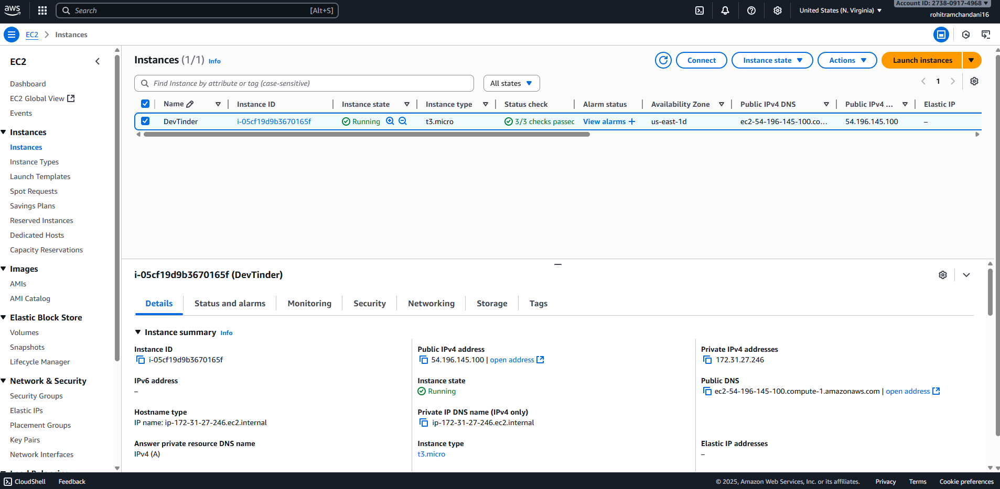
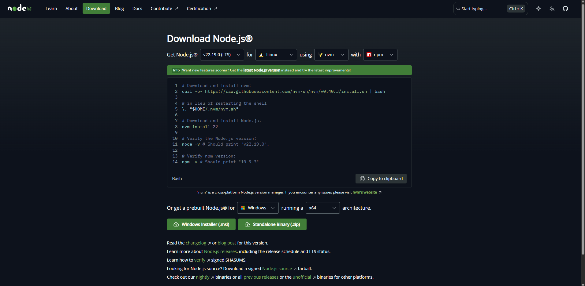

# Season 3 - Dev Tinder Application Deployment
- Now we will deploy our application on the actual server.
- We will create a server and we will deploy our application on that server.

## AWS - Amazon Web Service
- We will be using AWS to create our own instance, machine etc. to deploy our application.
- Till now we were running our application on the localhost.
- AWS is a very famous service amongst AWS, Google Cloud etc.
- There are various other ways to deploy the application in a single click from the github URL.

## Step 1: Create an AWS account
It will require a lot of personal details.

## Step 2: Create your Instance
- Search for EC2 (Elastic Compute) and go to the EC2 Page.
- Launch a new Instance (Create a new Server or Machine).
- Assign name to a web server.
- Use the Ubuntu Machine as a server.
- Select the Instance type as t3-micro, it is available for free.
- Keep all the instance as is.
- Key Pair Login
- When we will take a machine we will be requiring a way to access a machine.
- It is done with the help of a key i.e. public key and private key.
- We will be using the RSA Algorithm.
- Give the key as "devTinder-secret".
- Now download the .pem file.
- Launch the Instance
- Now the AWS is creating a new instance and it will give the access to the Instance using the .pem file which we have downloaded.

## Step 3: Connect to the Instance
- When we have the instance, click on the Instance Id.
- 
- We will have the public IP and the private IP of the machine.
- There are different ways to connect to the Instance or the Server.
- We will be connecting to the server with the help of SSH Client.


```text
Instance ID -> i-05cf19d9b3670165f (DevTinder)

1. Open an SSH client.

2. Locate your private key file. The key used to launch this instance is   
    devTinder-secret.pem

3. Run this command, if necessary, to ensure your key is not publicly viewable.
    chmod 400 "devTinder-secret.pem"

4. Connect to your instance using its Public DNS:
    ec2-54-196-145-100.compute-1.amazonaws.com

```

### Step 3.1 Command:
```cmd
ssh -i "devTinder-secret.pem" ubuntu@ec2-54-196-145-100.compute-1.amazonaws.com
```

- Go to the folder where you have downloaded the ssh key file -> .pem file.
- Run the commands listed above, to login to the machine.
- Now we are in the terminal of the machine.

## Step 4: Dependencies Installation:
- Now on the server we will be installing the dependencies.
- E.g. we will be installing the `Node.js`

 

- Command to install NodeJS
```cmd
curl -o- https://raw.githubusercontent.com/nvm-sh/nvm/v0.40.3/install.sh | bash
```

- Check the node version on the local PC
```cmd
Rohit's PC@LAPTOP-0BAD43SG MINGW64 /c/Incapp/Namaste Node JS/Season_3 (main)
$ node -v
v22.14.0
```

- Install the same version on the Instance, otherwise it will give issues.
```cmd
ubuntu@ip-172-31-27-246:~$ nvm install 22.14.0
Downloading and installing node v22.14.0...
Downloading https://nodejs.org/dist/v22.14.0/node-v22.14.0-linux-x64.tar.xz...
#################################################################################################################################################################################################################################### 100.0%
Computing checksum with sha256sum
Checksums matched!
Now using node v22.14.0 (npm v10.9.2)
Creating default alias: default -> 22.14.0 (-> v22.14.0)
```

## Step 5. Clone the code on to the instance
- Now the system is ready to get the project and run the project on the machine.
- We will get the code from the github.
- Clone the project in the server Instance.
```cmd
    ubuntu@ip-172-31-27-246:~$ git clone https://github.com/rohit161996/devTinder_Frontend.git

    ubuntu@ip-172-31-27-246:~$ git clone https://github.com/rohit161996/devTinder_Backend.git
```

## Step 6. Install and Build the Project Libraries
- We will not run the project using the command `npm run dev`
- We will have to compile the project on the Server using the command.
```
    npm run build
```
- It creates a dist folder which has the compiled files for the project.

```cmd
    ssh -i "devTinder-secret.pem" ubuntu@ec2-54-196-145-100.compute-1.amazonaws.com
    cd devTinder_Frontend/
    cd dev-tinder/
    npm install
    npm run build
```

## Nginx
- It is an open source software which is used to host the frontend project.
- Nginx creates an HTTP server onto which we deploy the HTTP server.
- Run the following commands to install the nginx on the system.
```cmd
    sudo apt update
    sudo apt install nginx
```

- Command to start the nginx
```cmd
    sudo systemctl start nginx
    sudo systemctl enable nginx
```

- Copy the code from the `dist(build files)` to `/var/www/html/`
```cmd
    sudo scp -r dist/* /var/www/html/
```

- On the AWS we have a public IP where we can access the server.
- This will not run if we give the Ip address to the Web Browser.
- Because the AWS blocks the IP address.
- We will have to expose the port number 80 as nginx runs on the port number 80, on the instance.
- Go to the Instance in the AWS, in that instance go to the Security.
- In that go to the Security Group.
- Add inbound rule to allow access to the port number 80.
- Go to the Edit Inbound Rule.
- Click on the Add rule.
- We will give the Ip 0.0.0.0/0 to allow it to be accessed anywhere from the Internet.

- Now the public Ip will host the front end of the server.


