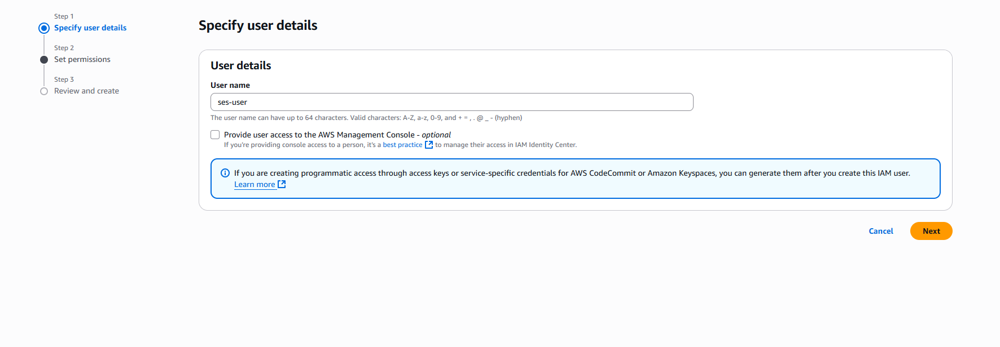
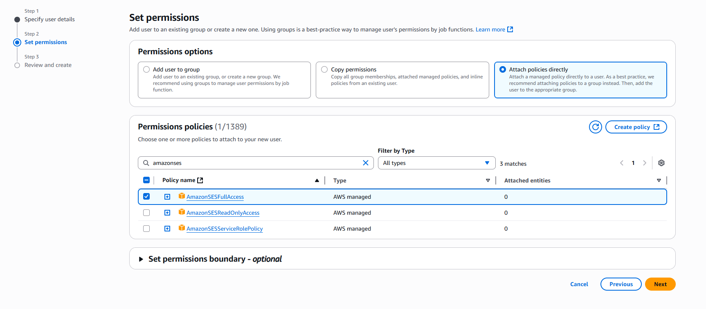
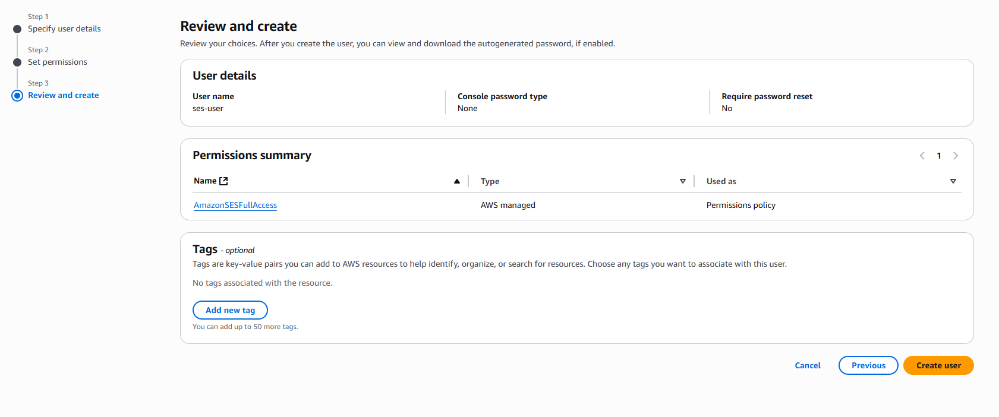
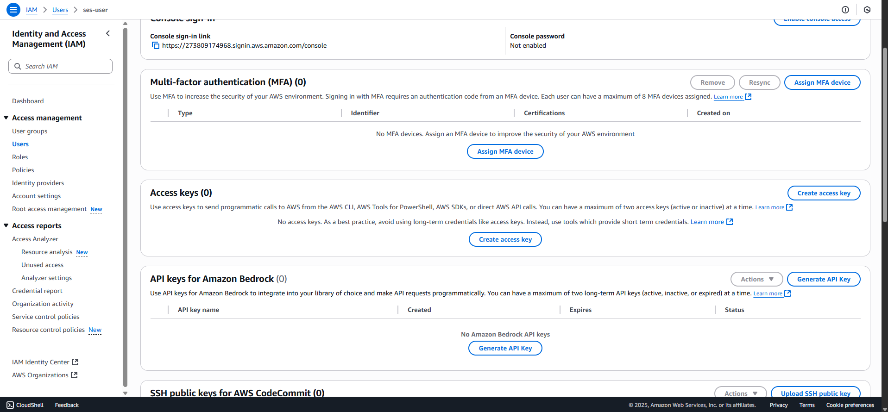
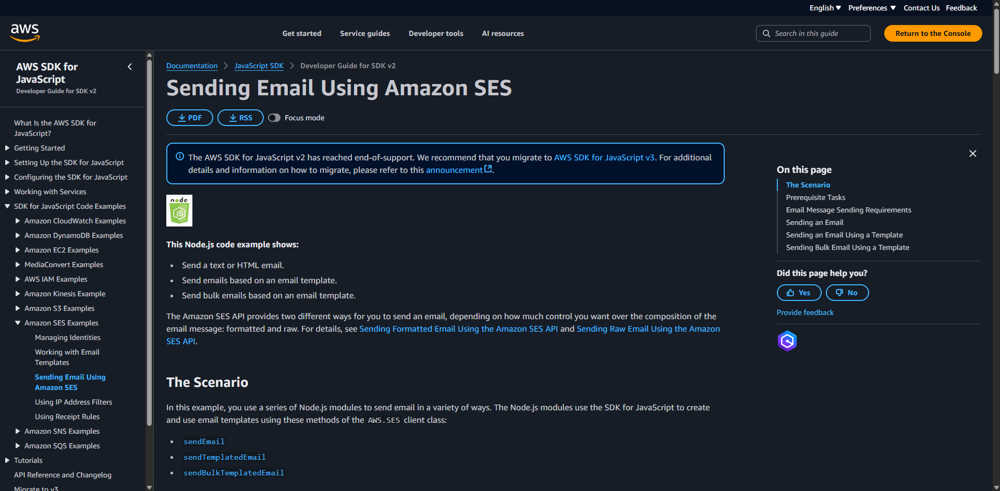

# Episode 4 : Sending Email to the User Using the Amazon SES
- We will be using the Amazon SES (Simple Email Service)
- Signup to the Amazon SES and activate the role of the IAM.

## Create the user
- Step 1. Now we will be creating the User, write the name of the user as "ses-user".
- Step 2. Since we are not joining as a group and we are joining as a single user we will "attach policies directly" and give permission to the user account.
- Step 3. Click on create user. 

- Now go to the Amazon SES.
- On the Amazon SES click on the Get Set Up

## Create Identity
- Step 1. Create the identity of the domain and the email verification on the AWS.

- Step 2. It will give the CNAME which will be given to the Domain Name Handler for the verification i.e. Cloudflare. Amazon wants to confirm that the domain name is with us to sen the email from the domain.

- Step 3. In the cloudflare create the dns records.It will take upto 72 hours to verify.

- We should request the production access to increase the daily limit of sending the emails.
- We will be able to access the full capabilities of the SES.

## Difference between domain identity and the email identity
- We have got the domain and we have prooved it by providing the DNS.
- If someone does not have the domain name email address can be provided.

## Now we will code to send the emails:
- We will be requiring the secret key to send the emails.
- The key will be extracted from the IAM.

- In the backend code base write the secret key in the .env file.
- Now we can get the code from 
- [Amazon SES Code to send Email.](https://docs.aws.amazon.com/sdk-for-javascript/v2/developer-guide/ses-examples-sending-email.html)

```js
/* Load the AWS SDK for Node.js */
var AWS = require("aws-sdk");

/* Set the region */
AWS.config.update({ region: "REGION" });

/* Create sendEmail params */
var params = {
  Destination: {
    /* required */
    CcAddresses: [
      "EMAIL_ADDRESS",
      /* more items */
    ],
    ToAddresses: [
      "EMAIL_ADDRESS",
      /* more items */
    ],
  },
  Message: {
    /* required */
    Body: {
      /* required */
      Html: {
        Charset: "UTF-8",
        Data: "HTML_FORMAT_BODY",
      },
      Text: {
        Charset: "UTF-8",
        Data: "TEXT_FORMAT_BODY",
      },
    },
    Subject: {
      Charset: "UTF-8",
      Data: "Test email",
    },
  },
  Source: "SENDER_EMAIL_ADDRESS" /* required */,
  ReplyToAddresses: [
    "EMAIL_ADDRESS",
    /* more items */
  ],
};

/* Create the promise and SES service object */
var sendPromise = new AWS.SES({ apiVersion: "2010-12-01" })
  .sendEmail(params)
  .promise();

/* Handle promise's fulfilled/rejected states */
sendPromise
  .then(function (data) {
    console.log(data.MessageId);
  })
  .catch(function (err) {
    console.error(err, err.stack);
  });

```

- Use the AWS SDK v3(latest version).
- [AWS SDK for JavaScript (v3) – Developer Guide](https://docs.aws.amazon.com/sdk-for-javascript/v3/developer-guide/welcome.html)  
- [AWS SDK JavaScript SES Code Examples](https://docs.aws.amazon.com/sdk-for-javascript/v3/developer-guide/javascript_ses_code_examples.html)  
- [GitHub – AWS SES Example Code](https://github.com/awsdocs/aws-doc-sdk-examples/tree/main/javascriptv3/example_code/ses#code-examples)

## Code to send emails
- In the `utils/` directory create the `sendEmail.js` file to write the code.

- Add the dotenv package in the project using the command
```cmd
    npm install dotenv
```

- Add the .env file to the project using the code in the `app.js`
```js
    require("dotenv").config();
```

- [SES Client Code to send Email.](https://github.com/awsdocs/aws-doc-sdk-examples/blob/main/javascriptv3/example_code/ses/src/libs/sesClient.js)

- Install the package to the code base.
```cmd
    npm install @aws-sdk/client-ses
```
- In the SES Client pass the credentials like given in the code below:
```js
    /* snippet-start:[ses.JavaScript.createclientv3] */
    const { SESClient } = require("@aws-sdk/client-ses");

    /* Set the AWS Region. */
    const REGION = "us-east-1";

    /* Create SES service object. */
    const sesClient = new SESClient(
        { 
            region: REGION,
            credentials: {
                accessKeyId: process.env.AWS_ACCESS_KEY,
                secretAccessKey: process.env.AWS_SECRET_ACCESS_KEY,
            },
        }
    );
    module.exports = { sesClient };

    /* snippet-end:[ses.JavaScript.createclientv3] */
```

- This is for the v3 version for the v2 version we pass the access key like:
```js
    /* snippet-start:[ses.JavaScript.createclientv3] */
    const { SESClient } = require("@aws-sdk/client-ses");

    /* Set the AWS Region. */
    const REGION = "us-east-1";

    /* Create SES service object. */
    const sesClient = new SESClient(
        { 
            region: REGION,
            accessKeyId: process.env.AWS_ACCESS_KEY,
            secretAccessKey: process.env.AWS_SECRET_ACCESS_KEY,
        }
    );
    module.exports = { sesClient };

    /* snippet-end:[ses.JavaScript.createclientv3] */
```

- Now, we have created the SES Client in the `/utils/sendClient.js`.
- Now, we have to create the SES Send Email in the `/utils/sendEmail.js`.
- Now, in the API add the following code to send the email.

```js
    /* Send the Email */
    const emailRes = await sendEmail.run(
        "A new Friend request from " + req.user.firstName,
        req.user.firstName + " is " + status + " in " + toUser.firstName
    );
```

- Now we have made the email more dynamic.
- We have the stats for the emails sent on the Account Dashboard 

