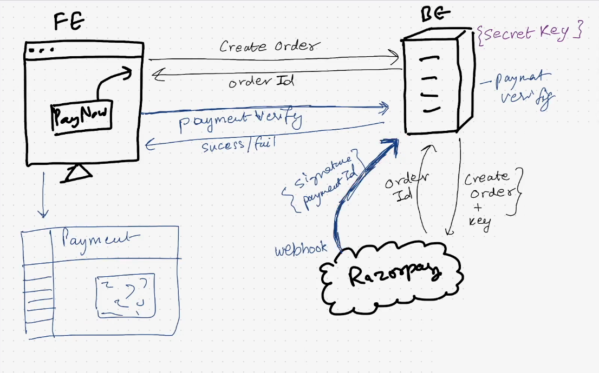

# Episode 7 - Payment Gateway Integration, ft. Razorpay
- These things should be done very securely.

## Payment Steps:
- The connection to the Payment Gateway is made only through the Backend.
- Backend has the secret key which acts as a password to connect the the Razorpay.
- Razorpay is a very famous Payment Gateway provider.

# Workflow of the payment page
### Step 1.
- The user clicks the `Pay Now` Button
- The frontend will call an API `/createOrder` to create the order.
- It is making the API call because the frontend is not talking directly to the Razorpay, since Razorpay requires {secret key}.
- The Backend sends the {createOrder request + secret Key} to the Razorpay.
- Razorpay sends back an orderId{userDetails, paymentPlan} to the backend, orderId is a unique value.

### Step 2.
- Now the Payment Page is opened from the Razorpay code.
- The user makes the payment.
- The information{signature + paymentId} about the payment is send from the Razorpay to the Backend using the Web Hooks.
- The Backend will now verify the payment -> {Payment Verification}
- If the payment is completed then the Backend will mark the user as premium.

### Step 3.
- Now the Frontend will make a request to the Backend to check that the payment is verified or not.
- The Backend will return success/failure to the FrontEnd.




## Step 0: Prerequisites to apply for the account:
- Add the pages to your website like Privacy Policy, Terms Of Service, Refund Policy, Team and Contact Us.
- Like the Pages present in the `www.namastedev.com` in the footer component.

## Step 1:
- Signup on Razorpay and complete KYC.

## Step 2:
### 1. Build the Front End Pages
- We will be building the `<Premium/>` component to buy the Premium.
- Add the Link from the `<NavBar/>` component to navigate to the Premium Component.  

### 2. Build the API in the Backend to create the order
- Create a route in the `routes/` directory with the name `payment.js`.
- We will be creating the Payment APIs in it.

## 1. Create Payment -> /payment/create
- It will be a post API.
- It will require the user authentication.
- When this API is hit it will createOrder on the RazorPay.
- Now to connect to the Razorpay see the Razorpay document.
- [Razorpay Documentation](https://razorpay.com/docs/payments/server-integration/nodejs/?preferred-country=IN)
- Now the Integration steps should be followed(but not blindly with some changes) to integrate the Razorpay with the Backend.
- [Razorpay Integration](https://razorpay.com/docs/payments/server-integration/nodejs/integration-steps/#integrate-with-razorpay-payment-gateway)

#### Step 1.1 Instantiate Razorpay
- Install the razorpay package.
```cmd
    npm install razorpay 
```
- In the `utils/` create the directory called razorpay.js
- In that write your configuration.
- The key_id and key_secret will be from the Razorpay Dashboard.
```js
    const Razorpay = require("razorpay"); 

    var instance = new Razorpay({
        key_id: process.env.RAZORPAY_KEY_ID,
        key_secret: process.env.RAZORPAY_KEY_SECRET,
    });

    module.exports = instance;
```
- Keep the KEY_ID and the KEY_SECRET in the .env file always.


#### Step 1.2 Create an order in the Server
- The API to create the order is called the `/payment/create` API.
- Create the 
```js
    const express = require("express");
    const { userAuth } = require("../middlewares/auth");
    const paymentRouter = express.Router();
    const razorpayInstance = require("../utils/razorpay");

    paymentRouter.post(
        "/payment/create",
        userAuth,
        async (req, res) => {
            try {
                const order = await razorpayInstance.orders.create({
                    amount: 70000,
                    currency: "INR",
                    notes: {
                        firstName: "value3",
                        lastName: "value2",
                        membershipType: "silver"
                    },
                });

                /* Save it in the Database */
                console.log(res);

                /* Return back my order details to Frontend */
                res.json({
                    order
                });
            }
            catch (err) {
                return res.status(500).json({ msg: err.message });
            }
        }
    );

    module.exports = paymentRouter;
```

- To store the information of the orders created a new schema should be created in the database.
- We will create a new model named payment, in the `models/` directory create a file named `payment.js`.
- Payment schema will refer to the User Schema.
- Now, we will import the model in the payment to store the order created in the database.
- Save the data in the Schema and return the saved Object.
- Do not pass the amount from the frontend to backend for the sensitive details like amount.
- It can be easily changed from the frontend and the user can end up buying the menbership in 1 rupee.
- The membership amount can be stored in the `constants.js` file in the backend.

#### Step 1.3 Open the Razorpay page to make the payment.
- We need to make some changes in the frontend to open the dialogue box of Razorpay.
- Add the script in the head tag of the `index.html`.
```html
    <script src="https://checkout.razorpay.com/v1/checkout.js"></script>
```
- This script gives the access to the razorpay object that we will need lateron.
- Now add the code in the React Component to open the razorpay window.
```js
    const rzp = new window.Razorpay(options);
    rzp.open();
```
- We will not be importing the package Razorpay we are getting it from the script added.
- So we need to call it using the window.Razorpay().
- Now we will be passing the options (only those which are required).

#### Step 1.4 Now we will verify the payment signature.
## 2. Payment Verification
- Now we will integrate the webhook Razorpay.
- Whenever we do a successful payment or failed payment Razorpay will give us a webhook.
- Go to the Razorpay dashboard and add the webhook and mention the webhook URL.
- Mention the webhook URL i.e. [Webhook URL to be used.](https://devtinder.in/api/payment/webhook)
- We want the Razorpay to inform us on this API.
- Add a secret and create the webhook, localhost will not work in this.
- [Webhook NodeJS Code](https://razorpay.com/docs/webhooks/validate-test/)

```js
    /* NODE SDK: https://github.com/razorpay/razorpay-node */
    const {validateWebhookSignature} = require('razorpay/dist/utils/razorpay-utils')

    validateWebhookSignature(JSON.stringify(webhookBody), webhookSignature, webhookSecret)
    #webhook_body should be raw webhook request body
```
- The API to verify the Payment is called as the `/payment/webhook` API, it will be the same as the one mentioned in the Razorpay account dashboard.
- The userAuth should not be present as a middleware in this API, since the Razorpay will be calling it.
- The Razorpay webhook secret is passed in the post API call.
- The req.body is passed in the webhook signature.

```js
paymentRouter.post(
    "/payment/webhook",
    async (req, res) => {
        try {
            const webhookSignature = req.get["X-Razorpay-Signature"];

            /* This is the main line which will validate the web hook signature */
            const isWebHookValid = validateWebhookSignature(
                JSON.stringify(req.body),
                webhookSignature,
                process.env.RAZORPAY_WEBHOOK_SECRET
            );

            if (!isWebHookValid) {
                return res.status(400).json({ msg: "Notebook signature is invalid" });
            }

            /* Update my payment status in the Database */
            const paymentDetails = req.body.payload.payment.entity;
            const payment = await Payment.findOne({ orderId: paymentDetails.order_id });
            payment.status = paymentDetails.status;
            await payment.save();

            const user = await User.findOne({ _id: payment.userId });
            user.isPremium = true;
            user.membershipType = payment.notes.membershipType;
            await user.save();

            /* Update the user as premium 
             * Captured = Success
             * Failed = failed
             */
            if (req.body.event == "payment.captured") {

            }

            if (req.body.event == "payment.failed") {

            }

            /* Return the success response to the Razorpay */
            return res.status(200).json({ msg: "Webhook received successfully" });
        }
        catch (err) {
            res.status(500).json({ msg: err.message });
        }
    }
);
```
- Webhook signature - whenever the razorpay will call our webhook, it will send us the request body which is passed in the `validateWebhookSignature()` function.
- It also sends us the header with name `X-Razorpay-Signature`, this header should be verified.
- Whether the payment succeeds or fails, the response that is returned will always be with status 200.
- The payment details should be updated in the database in the payment schema.
- The razorpay will be returning the `req.body.payload.payment.entity`, using this the details will be fetched from the database using the MongoDB query.
- The resonse will be like :
```js
    {
    "entity": "event",
    "account_id": "acc_BFQ7uQEaa7j2z7",
    "event": "payment.captured",
    "contains": [
        "payment"
    ],
    "payload": {
        "payment": {
            "entity": {
                "id": "pay_DESlfW9H8K9uqM",
                "entity": "payment",
                "amount": 100,
                "currency": "INR",
                "base_amount": 100,
                "status": "captured",
                "order_id": "order_DESlLckIVRkHWj",
                "invoice_id": null,
                "international": false,
                "method": "netbanking",
                "amount_refunded": 0,
                "amount_transferred": 0,
                "refund_status": null,
                "captured": true,
                "description": null,
                "card_id": null,
                "bank": "HDFC",
                "wallet": null,
                "vpa": null,
                "email": "gaurav.kumar@example.com",
                "contact": "+919876543210",
                "notes": [],
                "fee": 2,
                "tax": 0,
                "error_code": null,
                "error_description": null,
                "error_source": null,
                "error_step": null,
                "error_reason": null,
                "acquirer_data": {
                "bank_transaction_id": "0125836177"
                },
                "created_at": 1567674599
            }
        }
    },
    "created_at": 1567674606
    }
```
- The status of the payment is stored in the database.
- Now the user's details should also be updated in the database.
- The User Schema will also be updated now, to update the user type as premium.
- Store the details like isPremium, membershipType in the User Schema.

## Premium Features
- Add Blue Tick for the User.
- Do not limit the number of requests sent.

